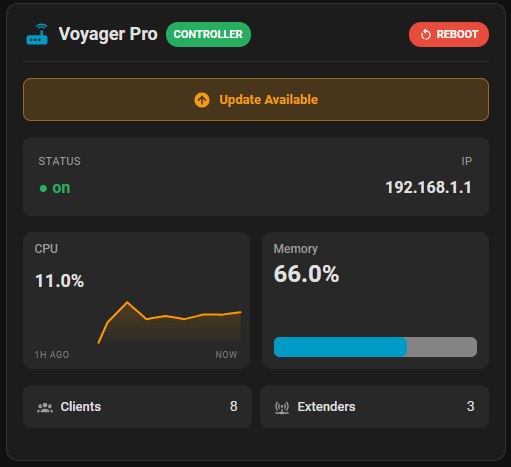

# Router Card
 

A highly customizable Home Assistant Lovelace card for monitoring routers, access points, and mesh network devices.

## 🌟 Features

🎯 Universal Compatibility - Works with any router integration that provides sensors

🔄 Controller & Repeater Support - Different badges for main routers and repeaters

📊 Flexible Layout - Two display sections: card view (top) and list view (bottom)

🎨 Customizable - Choose which sensors to display, custom icons, themes

📡 Status - Dedicated section for connection status and IP

⬇️ Updates - Allows you to track the availability of updates for the router

🌙 Theme Support - Default, dark, and light themes

## 📦 Installation
### Via HACS (Recommended)
1. HACS > Integrations > ⋮ > Custom repositories
2. URL: `https://github.com/RayzorST/Router-Card`
3. Category: Plugin
4. Search for "Router-Card" and install
### Manual Installation
1. Download `router-card.js` from the latest release
2. Place the file in `/config/www/community/router-card/`
3. Add the resource to your Lovelace dashboard:
    - Go to Settings → Dashboards → Resources
    - Click "+ Add Resource"
    - URL: `/hacsfiles/router-card/router-card.js`
    - Type: JavaScript Module

## Configuration

### Basic Configuration

~~~yaml
type: custom:router-card
name: Voyager Pro
icon: mdi:router-wireless
controller: true
update_section:
  enabled: true
  entity: update.router_update
  label: Update Available
  tap_action:
    action: more-info
status_section:
  enabled: true
  left_entity: input_boolean.router_status
  left_label: Status
  right_entity: input_text.router_ip
  right_label: IP
  tap_action:
    action: more-info
reboot_button:
  enabled: true
  entity: ""
  confirmation: true
  label: Reboot
  icon: mdi:restart
top_sensors:
  - entity: sensor.router_cpu
    name: CPU
    unit: ""
    icon: ""
    tap_action:
      action: more-info
    display_type: graph
    graph_detail: 2
    hours_to_show: 1
    min: 0
    max: 100
    smoothing: true
    aggregate: avg
  - entity: sensor.router_memory
    name: Memory
    unit: ""
    icon: ""
    tap_action:
      action: more-info
    display_type: bar
    graph_detail: 2
    hours_to_show: 24
    min: 0
    max: 100
    smoothing: true
    aggregate: avg
bottom_sensors:
  - entity: sensor.router_clients
    name: Clients
    unit: ""
    icon: mdi:account-group
    tap_action:
      action: more-info
  - entity: input_number.router_extenders
    name: Extenders
    unit: ""
    icon: mdi:access-point-network
    tap_action:
      action: more-info
~~~
